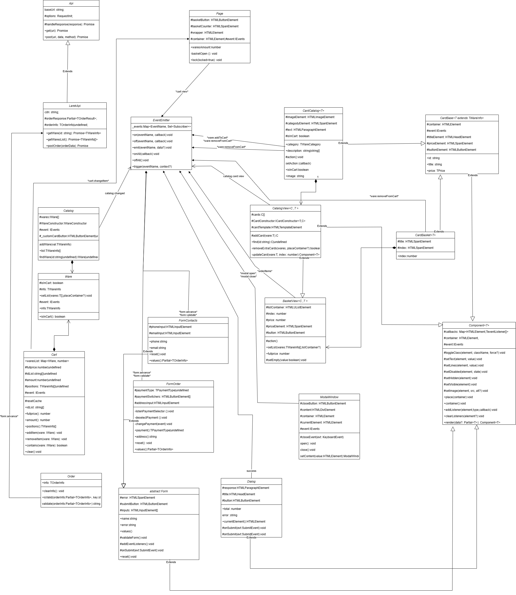

# Проектная работа "Веб-ларек"

Стек: HTML, SCSS, TS, Webpack
Подключены инструменты линтинга и форматирования.

Структура проекта:
- src/ — исходные файлы проекта
- src/components/ — папка с JS компонентами
- src/components/base/ — папка с базовым кодом

Важные файлы:
- src/pages/index.html — HTML-файл главной страницы
- src/types/index.ts — файл с типами
- src/index.ts — точка входа приложения
- src/styles/styles.scss — корневой файл стилей
- src/utils/constants.ts — файл с константами
- src/utils/utils.ts — файл с утилитами

## Установка и запуск
Для установки и запуска проекта необходимо выполнить команды

```
npm install
npm run start
```

или

```
yarn
yarn start
```
## Сборка

```
npm run build
```

или

```
yarn build
```


## Архитектура проекта ##

### Структура проекта ###
Проект построен по схеме MVP.

#### Модель ####
Модель проекта пожно разбить на 4 элемента:
- классы для работы с API, позволяющий принять с сервера данные по товарам, принять данные отдельного товара \
 и отправить список для оформления покупки с результатом в виде ответа сервера о стоимости товаров
- класс, содержащий данные о товаре и методы работы с этими данными
- класс для работы с каталогом товаров, позволяющий собрать данные о товаре в список и методы для работы с данным списком (добавление, удаление, поиск в каталоге)
- класс корзины, позволяющий собирать товары для покупки, с методами определения полной цены, списка артикулов и количества к покупке для каждого артикула

экземпляры классов каталога, корзины и товаров связаны через класс для управления данными, с методами этого класса и подразумевается работа

#### представление ####
представление можно разбить на 5 частей:
- классы карточек галереи, корзины и превьювера
- классы галереи и корзины
- классы форм отправки данных о покупке и диалог о результате
- класс модального окна
- класс управления страницей и её мелкими элементами

### UML схема ###
на стрелках показаны имена событий брокера событий


### Ключевые типы данных ###

- типы, относящиеся к товарам:
типы цены и категории, (последний выделил на случай необходимости ограничения категорий в дальнейшем, пока назначил string):
```
type TPrice=number|null;
type TWareCategory = string;
```
-- тип информации о товаре
```
type TWareInfo = {
  id: string;
  description: string;
  image: string;
  title: string;
  category: TWareCategory;
  price: TPrice;
};
```

- типы, относящиеся к заказу:
-- тип оплаты:
```
type TPaymentType = 'online' | 'cash';
```
-- тип информации о заказе:
```
type TOrderInfo = {
  total: number;
  items: string[] | undefined;
  email?: string;
  phone?: string;
  address?: string;
  payment: TPaymentType | undefined; 
};
```


```
 type TOrderResult = {
  id: string; //id покупки
  total: number; //полная сумма заказа
  error: string; //ошибка
};

 type TError = {
  error: string; 
};
```

### Базовый код ###

Располагается в папке **src/components/base** и в папке **src/utils/**

####  * функции для работы с DOM ####
располагаются в файле **src/utils/utils.ts**
Стоит выделить основные функции:
-*ensureElement* и *ensureAllElements*, принимающие на вход селектор или набор селекторов (вторая функция) и возвращающие DOM-элемент или их коллекцию, соответственно
-*cloneTemplate*, принимающую на вход темплэйт элемента, и возвращающую его клон

#### * Класс EventEmitter ####
располагается в файле **src/components/base/events.ts**
является брокером событий с интерфейсом 
```
IEvents {
    on<T extends object>(event: EventName, callback: (data: T) => void): void; \\Установить обработчик на событие
    emit<T extends object>(event: string, data?: T): void; \\ Инициировать событие с данными
    trigger<T extends object>(event: string, context?: Partial<T>): (data: T) => void; \\ Сделать коллбек триггер, генерирующий событие при вызове
}
```
также данный брокер позволяет
-Снять обработчик с события (метод: *off(eventName: EventName, callback: Subscriber)*)
-Слушать все события (метод: *onAll(callback: (event: EmitterEvent) => void)*)
-Сбросить все обработчики (метод: *offAll()*)

#### * Класс Компонент ####
Является абстрактным
располагается в файле **src/components/base/component.ts**
Принимает дженерик, определяющий тип объекта из которого рендерится отображение экземпляра класса
Имеет защищённое свойство - Map(элемент,TeventListener[] -- колбэки слушателя элемента с типом слушателя).
```
type TeventListener = {
    callback:TAction,
    type:string
  };
```
Также содержит защищённые методы:
- Переключение класса элемента (метод *toggleClass(element: HTMLElement, className: string, force?: boolean)*)
- назначение текста элементу  (метод *setText(element: HTMLElement, value: unknown)*)
- назначение многоблокового элемента с дублированием элемента поблочно, если на входе массив строк (метод *setLines(element: HTMLElement, value: unknown)*)
- переключить статус disabled элемента (метод *setDisabled(element: HTMLElement, state: boolean)*)
- спрятать элемент (метод *setHidden(element: HTMLElement)*)
- показать элемент (метод *setVisible(element: HTMLElement)*)
- назначить картинку и альт изображения (метод *setImage(element: HTMLImageElement, src: string, alt?: string)*)

имплементирует следующий интерфейс:
```
interface IComponent<T> {
    place(container: HTMLElement):void;     //разместить в элементе
    get container (): HTMLElement;      // Вернуть корневой DOM-элемент
    addListener(element:HTMLButtonElement|HTMLInputElement,type:string,callback:TAction);    //добавить слушатель к элементу
    clearListeners(element?:HTMLButtonElement|HTMLInputElement);    //снять слушатели с элемента/элементов
    render(data?: Partial<T>): Component<T>;    //рендерится отображение в контейнере
}
```

#### * Класс API ####
имплементирует следующий интерфейс:
```
interface IApi {
    get(uri: string); //получить данные с сервера
    post(uri: string, data: object, method: ApiPostMethods); //вывести данные на сервер
}
```


### сервисные компоненты ###

-  *LarekApi* отвечает за получение списка покупок с сервера при помощи публичных методов, возвращающих промисы
```
export interface ILarekApi extends IApi  {
  getWare(id: string): Promise<TWareInfo> //получить данные о товаре с сервера

  getWaresList(): Promise<TWareInfo[]>  //получить список товаров с сервера

  postOrder(orderData:TOrderInfo): Promise<Partial<TOrderResult>|void> //отправить заказ на сервер
  }

```


###  Компоненты модели данных (Model) ###
состоит из набора классов:
- *Ware*, экземпляры которого принимают информацию о товаре и информацию о наличии в корзине.\
при изменении полей в классе вызывается событие 'ware:change'
```
interface IWare {
  info: TWareInfo; // информация о товаре
  isInCart: boolean; // назначение и снятие того, что элемент в корзине
}

interface IWareConstructor {
  new (_info: TWareInfo, _event: IEvents): IWare;
}
```
- *Catalog* каталог товаров, содержащий массив экземпляров классов IWare
```
interface ICatalog {
  addWare(val: TWareInfo): void; // добавить товар в каталог
  list: TWareInfo[];  // список товаров (осуществляется геттером и сеттером)
  findWare(id: string): IWare | undefined; // поиск товара в каталоге по id
}
```
- класс *Order* содержит информацию о заказе, метод очистки информации. Также отвечает за валидацию полученных данных.
```
interface IOrder {
    info: TOrderInfo; //информация о заказе и пользователе
    clearInfo (info: Partial<TOrderInfo>): void; // очистка информации о заказе
    isValid(orderInfo:Partial<TOrderInfo>, key:string):boolean; //проверка валидности переданных данных по ключу
    validate(orderInfo:Partial<TOrderInfo>):string; //проверка валидности всех переданных данных
}
```
- класс корзины *Cart*
имеет защищённые поля кэша полной цены, набора айдишников, полного количества товаров и набора позиций, также есть метод сброса кэша при изменении любого параметра корзины.
количество товаров введено по причине того, что иначе в принципе нет необходимости в объекте корзины в модели товаров
```
interface ICart {
    waresList: Map<IWare, number>; //список товаров с количеством
    get fullprice(): number; //полная цена товаров в каталоге
    get idList(): string[]; //список айдишников товаров
    get amount(): number; //полное количество товаров
    addItem: (ware: IWare) => void; //добавить товар в корзину
    removeItem: (ware: IWare) => void; //удалить товар из корзины
    contains: (ware: IWare) => void; //содержит товар в корзине
    clear: () => void; //очистить корзину
  };
```

- класс заказа *Order*, хранит и собирает информацию о заказе, а также способен валидировать любую позицию в отдельности или сразу группу из любого количества товаров
```
interface IOrder {
  info: TOrderInfo; //информация о заказе и пользователе
  clearInfo (info: Partial<TOrderInfo>): void; // очистка информации о заказе
  isValid(orderInfo:Partial<TOrderInfo>, key:string):boolean; //проверка валидности переданных данных по ключу
  validate(orderInfo:Partial<TOrderInfo>):string; //проверка валидности всех переданных данных
}
```


### Компоненты представления (View) ###
Разбиты по файлам:
- *card.ts*  классы карточек
-- абстрактный класс *CardBase* принимает дом-элемент, сделанный из темплейта карточки и ивентэмиттер, позволяет назначить и получить общие данные по карточкам, выводимым в разных контейнерах\ имеет защищённые поля, отвечающие за кнопку **_buttonElement: HTMLButtonElement|undefined**, цену **_priceElement: HTMLSpanElement** и заголовок **protected _titleElement: HTMLHeadElement**, а также поле **_action: TAction;** отвечает за приём функции для выполнения при клике по кнопке (метод **setAction** в интерфейсе).
-- *CardCatalog* карточка в галерее, расширяет содержимое базовой карточки с опциональным полем: подробное описание.
-- *CardBasket* карточка в корзине, основана на базовой карточке, содержит порядковый номер в корзине
```
interface ICardBase<T> extends Component<T> {
    id: string; //id карточки
    title: string; // заголовок карточки
    set price(value: TPrice); // цена карточки
    setAction: (action: TAction) => void; // назначить действие с карточкой
  };

interface ICardCatalog<T> extends ICardBase<T> {
    image: string; //изображение карточки
    set category(value: TWareCategory);  // категория карточки
    set description(value: string | string[]); //подробное описание
    isInCart:boolean; //наличие в корзине
  };

interface ICardBasket<T> extends ICardBase<T> {
set index(value:number); //порядковый номер в корзине
};

interface ICardConstructor<T,C extends ICardBase<T>> {
  new (_container: HTMLElement, _event: IEvents, _customButtonSelector?:string): C;  
};
  
```
- *catalog.ts* контейнеры для карточек, конструктор контейнеров принимает на вход элемент самого контейнера, коннструктор и темплейта карточки, а также колбэк клика по карточке или кнопке в ней
-- *CatalogView* класс галереи, содержит список отображений карточек, принимает на вход, помимо самого контейнера, конструктор карточек и брокер событий, имеет защищённые свойства
---    **_cards:C[]** // где C - это интерфейс класса карточек
---    **_customButtonSelector:string|undefined** // селектор кастомной кнопки для карточки, при необходимости, если его нет, то активатором будет сама карточка.
и защищённые методы: 
--- **addCard(ware:T):C** // добавить карточку, создав её при помощи конструктора
--- setList(wares:T[],placeContainer?:HTMLElement|undefined):void //назначить список карточек, если уже есть карточки, то обновить их, удалив лишние
-- *IBasketView* расширяет класс галереи, содержит гарточки в корзине и полную цену, принимает на вход, помимо самого контейнера, конструктор карточек в корзине и брокер событий, защищённые свойства:
--- **_listContainer: HTMLUListElement** //контейнер, где располагаются карточки
--- **_index: number** //индекс каждой карточки в корзине
--- **_price: HTMLSpanElement** //полная цена
--- **_button: HTMLButtonElement;** //кнопка покупки
---  **action() :void** //действие при нажатии на кнопку
--- **setEmpty(value=true):void** //очистка корзины, фактически просто выключает кнопку
их интерфейсы:
```
interface ICatalogView<C, T> extends Component<T>{
  setList(wares: T[], placeContainer?: HTMLElement | undefined): void; //разместить карточки в каталоге
}

interface IBasketView<C, T> extends ICatalogView<C, T> {
  set fullprice(value: number); //полная цена в корзине
}

```


- *form.ts*

-- класс *Form* - абстрактный класс формы, следит за вводом инпутов, позволяет назначить и сбросить ошибку, при назначенной ошибке сабмит отсутствует\ имеет защищённые свойства:
--- **_error: HTMLSpanElement** //элемент ошибки
--- **_submitButton: HTMLButtonElement** //элемент кнопки сабмита
--- **_inputs: HTMLInputElement[]** //элемент ввода
--- **_name:string;** //имя формы
-- класс *FormOrder* - расширяет класс *Form* содержит переключатель кнопок вдобавок\ имеет защищённые свойства:
--- **_paymentType: TPaymentType|undefined** //тип опаты
--- **_paymentSwitchers: HTMLButtonElement[]** //переключатели типа оплаты
--- **_addressInput:HTMLInputElement** //элемент инпута адреса
имеет приватные методы:
--- **_listenPaymentSelector ()** //слушатель клика по опладе для переключения
--- **_deselectPayment ()**  //выключить все кнопки выбора оплаты
--- **_changePayment(event:MouseEvent|undefined):void** //переключить тип оплаты: выключает все кнопки и включает ту, по которой нажали
-- класс *FormContacts* - расширяет класс *Form* добавляя вывод инпутов\ имеет защищённые свойства:
--- **_phoneInput:HTMLInputElement;** 
--- **_emailInput:HTMLInputElement;**
```
interface IForm extends Component<object>{
    name: string; //геттер имени формы
    set error(value:string); //назначить ошибку
    reset():void; //сброс ошибки и инпутов и выключение кнопки
    get values():object //абстрактный метод выводит объект со всеми значениями инпутов и переключателей, реализуется в производных классах
}

interface IFormOrder<T> extends IForm {
    payment:T|undefined;
    address:string;
}

 interface IFormContacts extends IForm {
    phone:string;
    email:string;
}

-- *Dialog* расширяет класс компонент
```
 interface IDialog extends Component<object> {
set total (val:number); //полная сумма заказа
set error (val:string); //выводит ошибку вместо результата заказа
}
```


```

- *view.ts*
-- класс *Page* - отвечает за блокировку страницы и назначение количества товаров на иконке\ имеет защищённые свойства:
--- _basketButton: HTMLButtonElement;//элемент кнопки корзины
--- _basketCounter: HTMLSpanElement;//счётчик товаров в корзине
--- _wrapper: HTMLElement;//враппер страницы, используется для блокировки
```
export interface IPage {
    set waresAmount(value:number); // установить количество товаров в корзине
    lock(locked:boolean): void; //блокирует страницу
}
```

- *modal.ts* данный класс отвечает за открытие, закрытие модального окна и размещение в нём элементов\ имеет защищённые свойства:
--- closeEvent(evt: KeyboardEvent) //слушатель события закрытия окна, при открытой модалке навешивается на нажатие кнопки esc и клике по крестику или вне модалки
```
interface IModalWindow {
  open: () => void; //действия при открытии окна
  close: () => void; //действия при закрытии окна, также снимает слушатели закрытия модалки
  setContent(value:HTMLElement):IModalWindow; //разместить DOM-элемент в модалке
}
```

### логика работы, Presenter и взаимодействие с пользователем ###
создаются классы моделей корзины и каталога, каталог на вход принимает конструктор продукта, при получении списка товаров создаёт соответствующие экземпляры классов товара\
далее создаются классы отображения с присвоением им соответствующих DOM-элементов

Логика взаимодействий осуществляется посредством использования брокера событий, при взаимодействии с интерфейсом генерируются соответствующие события, на которые реагирует модель, запоминая и обрабатывая данные, а также изменяется отображение элементов

#### Структура логки ####
- создаются экземпляры классов модели, Api и новый брокер событий:
-- *cart*
-- *Catalog*
-- *order*
-- *LarekApi*
-- *EventEmitter()*

- определяются все доступные DOM-элементы и клонируются, при необходимости

- создаются экземпляры классов:
-- *Page*
-- *CatalogView*, принимает колбэк, эмитирующий событие просмотра карточки с указанием Id карточки
-- *BasketView*, принимает колбэк, эмитирующий событие удаления карточки с указанием Id карточки
-- *CardCatalog*, для модального окна, принимает колбэк для своей кнопки по удалению/добавлению в корзину
-- *ModalWindow*
-- *FormOrder*
-- *FormContacts*
-- *dialogSuccess*

- сразу обнуляется шаг заказа
- получается список карточки из экземпляра класса larekApi
- дальше выполняются действия брокера событий в соответствие с назначенными событиями

#### Список событий ####
- *catalog:changed* эмитируется при изменении каталога модели, вызывает изменение галереии в отображении
- *modal:open* событие эмитируется при открытии модального окна, блокирует страницу
- *modal:close* событие эмитируется при закрытии модального окна, разблокирует страницу, вызывает сброс форм до первоначального состояния, включая счётчик шагов заказа
- *catalog.card:view* событие эмитируется при клике на карточку, назначает свойства выбранной карточки экземпляру класса карточки-превьювера и выводит превьювер в модальное окно с открытием последнего
- *cart:changeItem* вызывается при попытке изменения элемента корзины (добавление, удаление), перестраивает отображение корзины на основе модели корзины, принимает полную цену из модели корзины и назначает количество товаров в корзине иконке, также заставляет модель карточки обновить наличие её в корзине на основании наличия в корзине
- *ware:addToCart* вызывается при клике на добавление карточки в корзину, добавляет карточку в модель корзины и эмитирует событие *cart:changeItem*
- *ware:removeFromCart* аналогично предыдущему, но удаляет карточку из корзины
- *orderItems* вызывается при клике в корзине на начало заказа, сбрасывает счётчик шагов заказа и выводит первую форму
- *form:advance* вызывается при сабмите форм, при каждом увеличивает счётчик шагов на 1:
-- на шаге 1 открывает форму 1
-- на шаге 2 вводит данные, полученные из формы в модель (валидируются данные на лету в процессе ввода, см. событие *form:validate*) и открывает вторую форму
-- на шаге 3 аналогично, что на шаге 2, но для другой формы, отправляет данные на сервер и открывает диалог с результатом покупки, сбрасывает модель корзины до пустой, соответственно вызывается сброс соответствующих элементов отображения
---при успехе(*.then*): выводит данные о сумме
---при неудаче(*.catch*): выводит данные об ошибке
- *form:validate* вызывается при каждом изменении инпута или нажатии на кнопку валидация формы, отправляет данные в модель класса заказа для валидации
- *success* успешная покупка, форма закрывается
- *cart:view* вызывается при нажатии на иконку, присваивает модальному окну элемент корзины


## Размещение в сети ##

[исходный код](https://github.com/Ashizius/web-larek-frontend.git)
